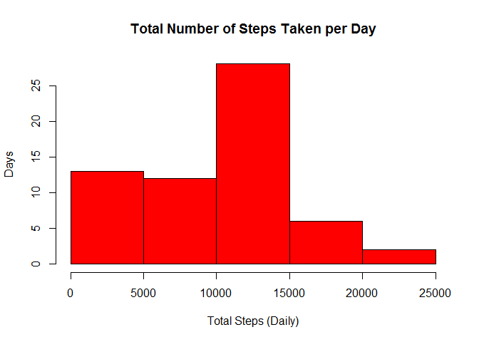
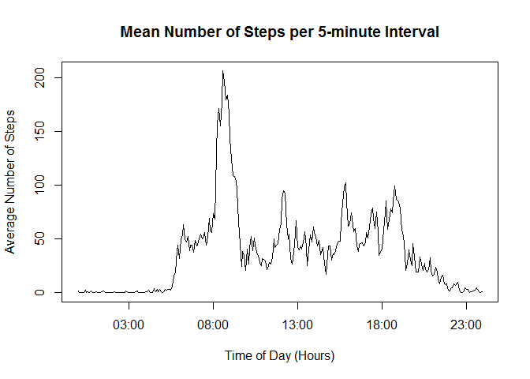
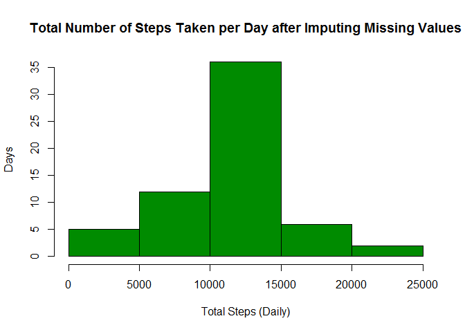
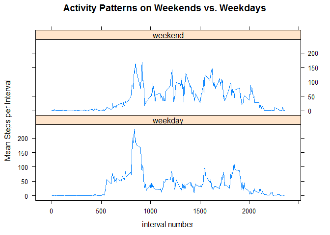

# Reproducible Research: Peer Assessment 1


## Loading and preprocessing the data

Unzip() the activity.csv file and use read.csv() to generate an R dataframe

```r
setwd("~/coursera/lectures/5-ReproducibleResearch/Assignment1/RepData_PeerAssessment1")
unzip("activity.zip")
actDF <- read.csv("activity.csv")
```

since subsequent analyses focus on time series analyses, we'll be processing the data to make date and time computer-readable:  
1. Use sprintf() to print leading 0's in the \$interval column for conversion to 24-hour format.  
2. Using strptime() to convert \$date and \$interval to time in the POSIXlt format  
3. Generate day of the week information using the weekday() function  

```r
actDF$interval <- sprintf("%04d", actDF$interval)
actDF$time <- strptime(actDF$interval, "%H%M")               
actDF$datetime <- strptime(paste(actDF$date, actDF$interval), "%Y-%m-%d %H%M")
actDF$weekday <- weekdays(strptime(actDF$date, "%Y-%m-%d"), abbreviate=TRUE)
```

## What is mean total number of steps taken per day?

#### Part 1 - Histogram

Use the ddply() function in plyr to split by date, and obtain the total number of steps per day in the actDF dataframe:

```r
library(plyr)
stepSum <- ddply(actDF, .(date),
      summarize,
      dailySum = sum(steps, na.rm=TRUE)
      )
```
The following plots a histogram of the total number of steps taken daily:

```r
hist(stepSum$dailySum, col="red", ylab="Days", xlab="Total Steps (Daily)", main="Total Number of Steps Taken per Day")
```

 

#### Part 2 - Mean and Median

To calculate the mean and median of the total number of steps daily:

```r
medSteps <- median(stepSum$dailySum, na.rm=TRUE)
meanSteps <- mean(stepSum$dailySum, na.rm=TRUE)
```
The **mean** total daily steps was **9354.2295**; the **median** total daily steps was **10395**


## What is the average daily activity pattern?

#### Part 1 - Time Series Plot

Use the ddply() function to split by interval, and obtain the mean number of steps at every 5-minute time interval in the actDF dataframe:

```r
library(plyr)
intervalMean <- ddply(actDF, .(time),
      summarize,
      intMean = mean(steps, na.rm=TRUE)
      )
```
The following plots a time-series of the mean number of steps per 5 minute interval

```r
plot(x=intervalMean$time, y=intervalMean$intMean, type="l", xlab="Time of Day (Hours)", ylab="Average Number of Steps", main="Mean Number of Steps per 5-minute Interval")
```

 

#### Part 2 - Interval with the Maximum Average Steps
1. Use the strftime() function to extract the 24-hour time from a POSIXlt object  
2. find the row containing the max mean steps using which.max() and output the corresponding interval

```r
intervalMean$interval <- strftime(intervalMean$time, format="%H%M")
maxMean <- intervalMean$interval[which.max(intervalMean$intMean)]
```
The time interval in which the **maximum average steps** was taken is  **0835**

## Imputing missing values

#### Part 1 - Total number of missing values

```r
naTotal <- sum(is.na(actDF$steps))
```
The **total number of missing values** is  **2304**

#### Part 2 and 3 - Devise a strategy for filling in missing values

I will be filling in NA values using the mean number of steps taken per 5 minute interval as calculated above. I've implemented this using two for loops to do the join which is computationally time-consuming. I've created this new dataset as the \$stepFIllNA column in the actDF dataframe. As a result, I've set cache=TRUE for this codeblock


```r
for (i in 1:NROW(actDF)) { #loops through every row in actDF
    if (is.na(actDF$steps[i])) { # if steps is NA
        for (j in 1:NROW(intervalMean)) { # loop through intervalMean to find corresponding interval
            if (intervalMean$interval[j] == actDF$interval[i]) { 
                actDF$stepFillNA[i] <- intervalMean$intMean[j] # set stepsFillNA to interval mean
            }
        }
    }
    else {
        actDF$stepFillNA[i] <- actDF$steps[i] #copies steps value to new column
    }    
}
```

#### Part 4 - Histogram and Mean and Median of Total Steps

**Histogram** - Use the ddply() to split by date, and obtain the total number of steps per day for the $stepFillNA column. 

```r
library(plyr)
stepFillNASum <- ddply(actDF, .(date),
      summarize,
      dailySum = round(sum(stepFillNA, na.rm=TRUE))
      )
```
The following plots a histogram of the total number of steps taken daily:

```r
hist(stepFillNASum$dailySum, col="green4", ylab="Days", xlab="Total Steps (Daily)", main="Total Number of Steps Taken per Day after Imputing Missing Values")
```

 

**Mean and Median** of the total number of steps daily:

```r
medStepFillNA <- median(stepFillNASum$dailySum)
meanStepFillNA <- mean(stepFillNASum$dailySum)
```
The **mean** total daily steps was **1.0766 &times; 10<sup>4</sup>**; the **median** total daily steps was **1.0766 &times; 10<sup>4</sup>**

Imputing NA values shifted the histogram distribution towards the right, thereby making the values more normally distributed. This also had the effect of shifting the mean and median towards higher values.

## Are there differences in activity patterns between weekdays and weekends?  
create factor variable  for weekday and weekends  

```r
for (d in 1:NROW(actDF)) {
  if (actDF$weekday[d] == "Sat" || actDF$weekday[d] == "Sun" ) {
    actDF$weekdayF[d] <- "weekend"
  }
  else {
    actDF$weekdayF[d] <- "weekday"
  }
}
```

aggregate interval mean by weekday and weekends

```r
intMeanWeekdayF <- aggregate(actDF$stepFillNA, list(interval = actDF$interval, weekdayF=actDF$weekdayF), mean)
```
 
Use lattice plot to generate 2-panel plot for weekday and weekend 

```r
 library(lattice)
 xyplot(x ~ as.numeric(interval) | weekdayF, 
      data=intMeanWeekdayF, type="l", 
      ylab="Mean Steps per Interval", 
      xlab="interval number", 
      main="Activity Patterns on Weekends vs. Weekdays",
      layout=c(1, 2))
```

 
